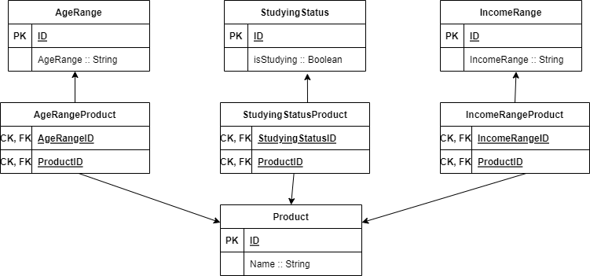

# Product suggester backend

## Building and running the backend part
You need  Java 8 (https://www.oracle.com/java/technologies/javase/javase8-archive-downloads.html) and Maven (https://maven.apache.org/download.cgi) installed.
Clone the project with the command:
```
git clone https://github.com/EvalVis/Product-suggester-backend
```
Then go to the recently downloaded backend app folder and run:
```
mvn spring-boot:run
```
The app should start, however, for the complete functionality you need to setup the frontend part: https://github.com/EvalVis/Product-suggester-frontend.

## Packaging the backend part
The mvn spring-boot:run will build, package and run the application. However, if you only need the jar file you can cd into the folder pom.xml is and run:
```
mvn package
```
When go to target folder. The .jar file should be generated. You can run it with the command:
```
java -jar [.jar name].jar
```
## Database
The app has a runtime database, so it does not provide persistence.
However, if a relational db would be created it should look like this:

<br />
Currently, the many to many relationships are implemented with hashmaps and products are retrieved simulating the join operation which could be performed in the database.